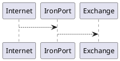

# Coubiac

Sources du blog [coubiac.github.io](https://coubiac.github.io).

Le site est généré automatiquement par GitHub Pages à partir de la branche `main`.

## Ajouter un article

Les articles sont des fichiers Markdown placés dans `_posts` et nommés selon le format `AAAA-MM-JJ-titre.md`.

Chaque article commence par un en-tête YAML :

```yaml
---
layout: post
title: Titre de l'article
description: Résumé affiché sur la page d'accueil.
tags:
  - PowerShell
---
```

## Ajouter un schéma PlantUML

Les sources PlantUML sont placées dans `assets/diagrams` avec l'extension `.puml`.

Exemple :



À chaque modification d'un fichier `.puml` sur la branche `main`, le workflow `.github/workflows/plantuml.yml` génère automatiquement le fichier SVG correspondant dans le même répertoire.

Ainsi :

```text
assets/diagrams/mail-flow.puml
        |
        +--> assets/diagrams/mail-flow.svg
```

Le SVG peut ensuite être inséré dans un article Markdown :

```markdown

```

Le fichier `.puml` reste la source à modifier. Le SVG généré ne doit normalement pas être édité à la main.
