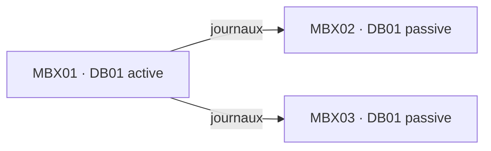
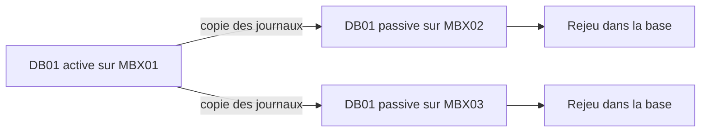
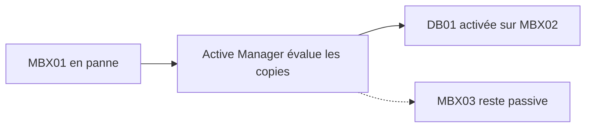
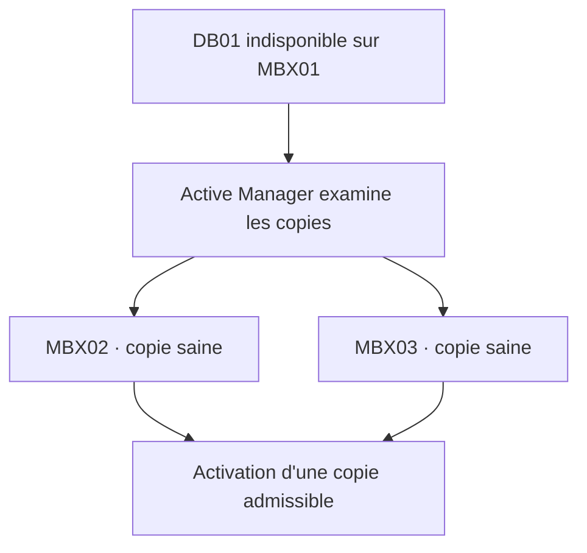
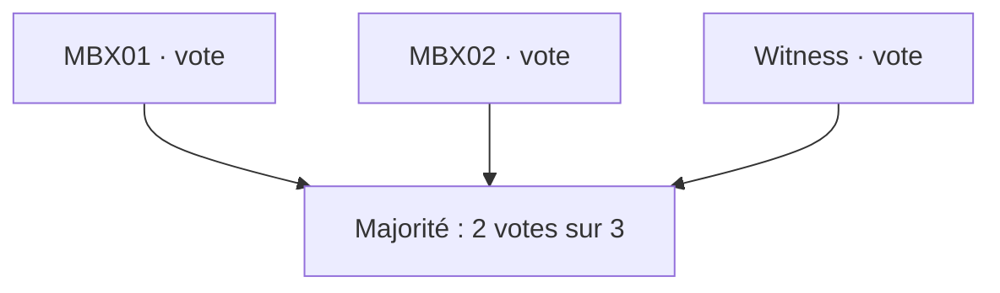
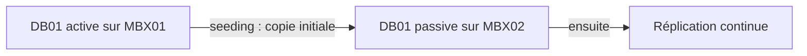
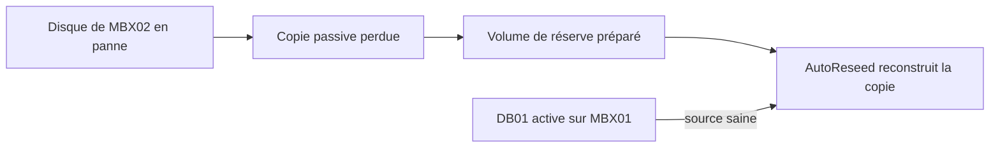
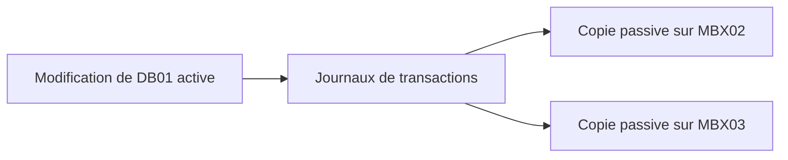
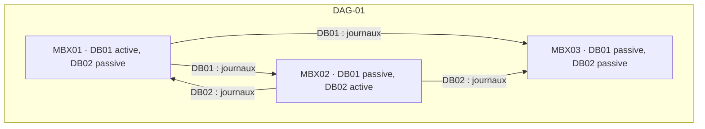

# Exchange Server : comprendre le fonctionnement d'un DAG

Quand on découvre la haute disponibilité dans Exchange Server, le terme "DAG" apparaît très vite.

DAG signifie **Database Availability Group**, ou groupe de disponibilité de bases de données.

Mais un DAG n'est pas simplement un "cluster Exchange".

Pour comprendre son fonctionnement, il faut surtout retenir une idée :

> **La haute disponibilité d'Exchange est centrée sur les bases de données et leurs copies, pas sur le déplacement d'un serveur Exchange d'une machine à une autre.**

Une fois cette idée comprise, les notions de réplication, failover, quorum, seeding, JBOD et AutoReseed deviennent beaucoup plus faciles à relier entre elles.

## Partons d'un Exchange sans DAG

Prenons un serveur Exchange `MBX01` qui héberge une base `DB01`, son fichier `.edb` et ses journaux de transactions.

Les boîtes aux lettres des utilisateurs se trouvent dans `DB01`.

Si le serveur tombe complètement en panne, la base n'est plus disponible.

Même problème si le stockage qui contient `DB01` devient inaccessible.

On peut bien sûr protéger le stockage avec du RAID, sauvegarder Exchange et disposer de pièces de rechange.

Mais cela ne fournit pas nécessairement une continuité de service immédiate.

C'est précisément le problème auquel répond le DAG.

## Le principe d'un DAG

Ajoutons trois serveurs Exchange au DAG `DAG-01`, puis plaçons une copie de `DB01` sur chacun d'eux :



Il s'agit bien de **trois copies de la même base de données**.

Une seule copie peut être active à un instant donné. C'est celle qui est montée et utilisée par Exchange.

Les autres copies restent passives, mais sont maintenues à jour par la réplication.

Un DAG peut contenir jusqu'à 16 serveurs Exchange Mailbox et une base peut disposer de copies réparties entre les membres du groupe.

## Une base appartient-elle encore à un serveur ?

C'est l'un des changements de raisonnement importants.

Sans DAG, `DB01` est liée à `MBX01`. Dans un DAG, la base est définie dans l'organisation Exchange et possède plusieurs copies.

| Copie | Avant la panne | Après le basculement |
|---|---|---|
| `DB01\MBX01` | Active | Indisponible |
| `DB01\MBX02` | Passive | Active |
| `DB01\MBX03` | Passive | Passive |

`DB01` existe toujours.

C'est simplement sa copie active qui a changé de serveur.

C'est ce que Microsoft appelle la **database mobility**.

## Comment les copies restent-elles synchronisées ?

Exchange utilise les journaux de transactions.

Lorsqu'une modification intervient dans une boîte aux lettres, l'opération est d'abord écrite dans les transaction logs avant d'être intégrée à la base `.edb`.

Dans un DAG, ces journaux servent également à maintenir les copies passives à jour.

De façon simplifiée :



Lorsqu'une nouvelle copie est créée, Exchange réalise d'abord une copie initiale de la base, puis la réplication continue prend le relais.

Deux valeurs deviennent alors particulièrement utiles pour l'administrateur : `CopyQueueLength` et `ReplayQueueLength`.

**CopyQueueLength** représente le nombre de journaux que la copie passive doit encore recevoir.

**ReplayQueueLength** représente le nombre de journaux déjà reçus mais qui doivent encore être rejoués dans la base passive.

On peut les afficher avec :

```powershell
Get-MailboxDatabaseCopyStatus * |
    Format-Table Name,Status,CopyQueueLength,ReplayQueueLength
```

Une file qui augmente durablement peut signaler un problème de réplication, de réseau, de stockage ou de performances.

## Que se passe-t-il lorsque MBX01 tombe en panne ?

Reprenons notre exemple : `DB01` est active sur `MBX01` et possède deux copies passives. `MBX01` tombe en panne. Exchange doit déterminer quelle copie passive peut devenir active.

Ce travail est assuré par **Active Manager**, un composant du service Microsoft Exchange Replication.

Après sélection d'une copie appropriée :



La base est montée sur `MBX02`.

Les utilisateurs peuvent alors retrouver l'accès à leurs boîtes aux lettres.

Il ne s'est produit aucun "déplacement de serveur".

C'est **la copie active de la base qui a changé**.

## Failover et switchover

Deux termes proches correspondent à deux situations différentes.

Un **failover** est un basculement provoqué par une panne. Un **switchover** est volontaire.

Par exemple, avant une maintenance sur `MBX01`, l'administrateur peut déplacer la base :

```powershell
Move-ActiveMailboxDatabase DB01 -ActivateOnServer MBX02
```

`DB01` devient active sur `MBX02` et passive sur `MBX01`.

Le même principe de mobilité de la base est utilisé, mais l'opération est cette fois planifiée.

## À quoi sert ActivationPreference ?

Une base peut avoir plusieurs copies susceptibles d'être activées.

On peut donc définir un ordre de préférence : `DB01\MBX01` vaut 1, `DB01\MBX02` vaut 2 et `DB01\MBX03` vaut 3.

Par exemple :

```powershell
Add-MailboxDatabaseCopy `
    -Identity DB01 `
    -MailboxServer MBX02 `
    -ActivationPreference 2
```

La valeur `1` indique la copie préférée.

Il ne faut toutefois pas comprendre `ActivationPreference` comme une consigne absolue du type "utilise toujours cette copie en premier".

Lors d'un basculement, Exchange évalue d'abord l'état des copies et différents critères de santé. Une copie avec une préférence moins favorable peut donc être choisie si elle est dans un meilleur état.

## Active Manager : le cerveau de la mobilité des bases

Active Manager est chargé de gérer l'état actif ou passif des copies.

Dans un DAG, on rencontre le **PAM** (Primary Active Manager) et les **SAM** (Standby Active Manager).

Le **PAM** coordonne notamment les décisions de basculement des bases au niveau du DAG.

Les **SAM** présents sur les autres membres surveillent l'état local et participent à la détection des incidents.

On peut simplifier ainsi :



Le processus réel utilise davantage de critères, mais ce modèle suffit pour comprendre le rôle d'Active Manager.

## Et Windows Failover Clustering dans tout ça ?

Un DAG s'appuie sur des composants de **Windows Server Failover Clustering**.

Lorsque des serveurs sont ajoutés à un DAG, Exchange crée et configure le cluster sous-jacent nécessaire à son fonctionnement.

L'administrateur Exchange travaille cependant principalement avec le DAG, les bases et leurs copies.

Le cluster Windows fournit les mécanismes de membres et de quorum ; Exchange gère l'état des copies et leur activation avec le DAG et Active Manager.

Il ne faut donc pas administrer un DAG comme s'il s'agissait d'un cluster applicatif Windows classique.

Exchange pilote lui-même une grande partie des opérations liées au cluster.

## Le quorum : qui a le droit de continuer ?

Le cluster doit également éviter une situation dangereuse.

Imaginons quatre serveurs répartis sur deux sites : `MBX01` et `MBX02` sur le site A, `MBX03` et `MBX04` sur le site B.

La liaison réseau entre les deux sites tombe.

Chaque côté peut encore voir ses propres serveurs, mais plus ceux de l'autre site.

Il faut alors éviter que les deux groupes continuent à fonctionner indépendamment en pensant chacun être le groupe légitime.

C'est l'un des rôles du **quorum**.

Le principe à retenir est :

> **Un ensemble suffisant de votes doit rester disponible pour que le cluster puisse continuer à fonctionner.**

Le quorum empêche plusieurs parties isolées du cluster de fonctionner simultanément comme si elles possédaient toutes l'autorité.

## À quoi sert le witness ?

Le **witness**, ou serveur témoin, participe au mécanisme de quorum.

Il n'héberge pas de base Exchange et ne devient jamais un serveur Exchange supplémentaire.

Son rôle est uniquement d'aider le cluster à conserver une majorité lorsque la topologie le nécessite.

Un DAG à deux membres peut par exemple être représenté ainsi :



Le witness fournit un vote supplémentaire au mécanisme de quorum.

Le quorum, les votes dynamiques et les scénarios multisites méritent un article dédié : pour comprendre le fonctionnement général d'un DAG, il suffit surtout de retenir que **le quorum détermine quelle partie du cluster a le droit de continuer à fonctionner**.

## Qu'est-ce que le seeding ?

Lorsqu'on crée pour la première fois une copie de `DB01` sur `MBX02`, il faut transférer une copie initiale complète de la base.

Cette opération s'appelle le **seeding**.



Cette base initiale devient ensuite le point de départ de la réplication continue.

Si une copie devient plus tard irrécupérable ou trop désynchronisée, il peut être nécessaire de la reconstruire.

On parle alors couramment de **reseed**.

Par exemple :

```powershell
Update-MailboxDatabaseCopy "DB01\MBX02" -DeleteExistingFiles
```

Cette notion devient particulièrement importante lorsqu'on étudie AutoReseed.

## AutoReseed devient maintenant beaucoup plus simple à comprendre

Supposons que `MBX02` possède une copie passive de `DB01`. Son disque tombe en panne. La production continue grâce à la copie active sur `MBX01`, mais le DAG a perdu une copie.



Le seeding crée une copie initiale ; le reseeding reconstruit une copie en échec. AutoReseed automatise ce dernier cas lorsque les volumes de réserve ont été préparés.

C'est pour cette raison qu'il est préférable de comprendre le DAG avant d'étudier le JBOD et AutoReseed.

## Attention : un DAG n'est pas une sauvegarde

La présence de plusieurs copies protège contre une panne de serveur ou de stockage et permet certaines opérations de maintenance.

Mais les copies du DAG reçoivent les modifications de la base active.

Si un utilisateur supprime volontairement une donnée et que cette suppression est validée par Exchange, elle est également répliquée.

Même chose pour certains dégâts logiques : la réplication n'a pas vocation à décider si une modification était souhaitable.



Le DAG assure donc principalement **la disponibilité des données**, pas leur conservation historique.

Sauvegardes, mécanismes de rétention, lagged copies et stratégie de cyber-récupération répondent à des besoins différents.

Pour ce sujet, voir également :

[Exchange Server : Circular Logging, sauvegardes, Preferred Architecture et ransomware](/articles/exchange-circular-logging-sauvegardes-cyber-recovery/)

## Comment surveiller un DAG ?

Quelques commandes permettent déjà de comprendre rapidement son état.

Afficher les membres :

```powershell
Get-DatabaseAvailabilityGroup DAG-01 -Status |
    Format-List Name,Servers,OperationalServers,*Witness*
```

Afficher toutes les copies :

```powershell
Get-MailboxDatabaseCopyStatus *
```

Une vue plus lisible :

```powershell
Get-MailboxDatabaseCopyStatus * |
    Format-Table Name,Status,CopyQueueLength,ReplayQueueLength,ActiveCopy
```

Tester la réplication :

```powershell
Test-ReplicationHealth
```

Afficher les bases et leurs serveurs :

```powershell
Get-MailboxDatabase -Status |
    Format-Table Name,Server,Mounted
```

Ces commandes permettent notamment de vérifier :

- quelle copie est active ;
- quelles copies sont saines ;
- si les journaux s'accumulent dans les files de copie ou de rejeu ;
- si les principaux mécanismes de réplication fonctionnent correctement.

## Et le réseau de réplication ?

Un DAG n'impose pas obligatoirement une carte réseau dédiée à la réplication.

On rencontre encore des architectures utilisant deux réseaux, l'un pour les clients et l'autre pour la réplication.

Cette configuration est possible.

La Preferred Architecture de Microsoft privilégie cependant une conception plus simple avec une seule interface réseau par serveur pour la connectivité et la réplication.

Le DAG repose sur plusieurs membres, des copies de bases, la réplication, Active Manager et le quorum. La présence d'un réseau dédié relève d'un choix d'architecture.

## Le modèle mental à retenir

Toute l'architecture peut finalement être résumée par ce schéma :



Les idées essentielles sont les suivantes :

| Notion | Rôle |
|---|---|
| **DAG** | Groupe de serveurs Exchange Mailbox assurant la haute disponibilité des bases |
| **Database copy** | Copie d'une base présente sur un membre du DAG |
| **Active copy** | Copie actuellement montée et utilisée |
| **Passive copy** | Copie répliquée pouvant être activée |
| **Continuous replication** | Réplication des modifications à partir des transaction logs |
| **Active Manager** | Composant Exchange chargé de la mobilité des bases |
| **Failover** | Basculement à la suite d'une panne |
| **Switchover** | Basculement volontaire |
| **Seeding** | Création initiale d'une copie |
| **Reseeding** | Reconstruction d'une copie |
| **Quorum** | Mécanisme déterminant quelle partie du cluster peut continuer |
| **Witness** | Témoin participant au quorum lorsque la topologie le nécessite |

Une fois ces notions comprises, les architectures Exchange utilisant du JBOD et AutoReseed deviennent beaucoup moins mystérieuses.

La perte d'un disque n'entraîne pas nécessairement la perte de la base si d'autres copies saines existent dans le DAG. Il faut ensuite reconstruire la copie perdue : c'est à ce moment qu'intervient AutoReseed.

## Pour aller plus loin

Le DAG permet donc d'accepter la perte d'une copie locale d'une base tant que d'autres copies saines existent ailleurs.

Cette propriété permet à Exchange d'utiliser des architectures de stockage assez différentes des architectures traditionnelles basées principalement sur le RAID.

C'est notamment le principe derrière le JBOD et AutoReseed : un disque peut être considéré comme remplaçable, tandis que les copies du DAG assurent la disponibilité des données et permettent ensuite de reconstruire la copie perdue.

→ [Exchange Server : comprendre le JBOD, les points de montage et AutoReseed](/articles/comprendre-jbod-points-montage-autoreseed-exchange-server/)

## Sources

- [High availability and site resilience in Exchange Server](https://learn.microsoft.com/en-us/exchange/high-availability/high-availability)
- [Database availability groups](https://learn.microsoft.com/en-us/exchange/high-availability/database-availability-groups/database-availability-groups)
- [Manage database availability groups](https://learn.microsoft.com/en-us/exchange/high-availability/manage-ha/manage-dags)
- [Mailbox database copies](https://learn.microsoft.com/en-us/exchange/high-availability/database-availability-groups/database-copies)
- [Active Manager](https://learn.microsoft.com/en-us/exchange/high-availability/database-availability-groups/active-manager)
- [Manage mailbox database copies](https://learn.microsoft.com/en-us/exchange/high-availability/manage-ha/manage-database-copies)
- [Exchange Server Preferred Architecture](https://learn.microsoft.com/en-us/exchange/plan-and-deploy/deployment-ref/preferred-architecture)
